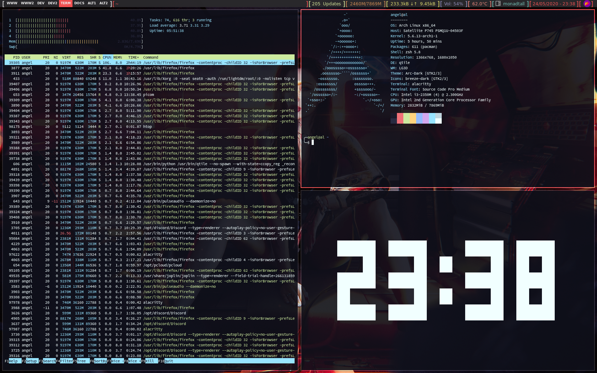

# Dotfiles

This repository was created to handle the dotfiles of my setup. I storage them here for convenience so I can acces them later on new machines. If you find some of my configuration helpful, feel free to copy them. Happy customization!

## How to manage Dotfiles

To manage this repository I use the git bare repository method, here is a **[guide](https://www.atlassian.com/git/tutorials/dotfiles)** that helped me to do that.
